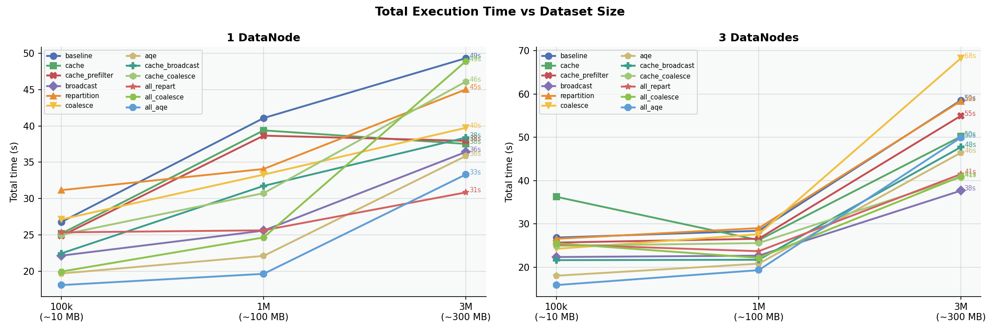
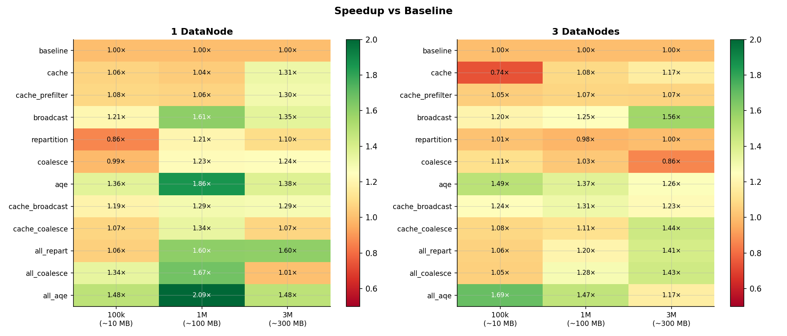
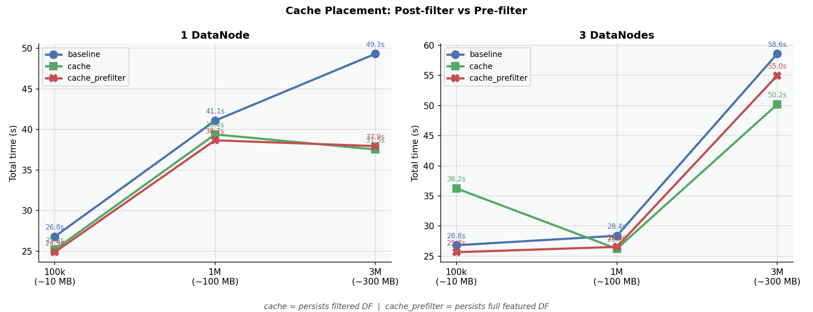
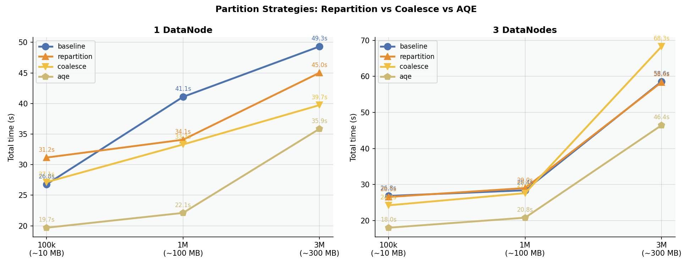
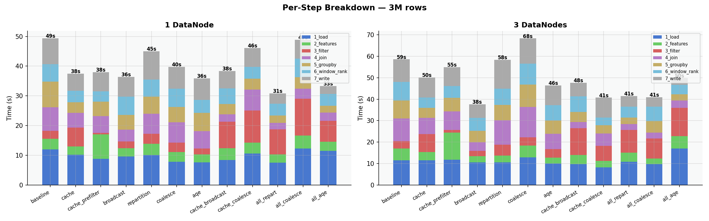

# Hadoop + Spark Lab

Distributed data processing experiment comparing HDFS cluster configurations (1 vs 3 DataNodes) and Spark optimization strategies across dataset sizes (100k / 1M / 3M rows).

---

## Environment

- Docker Desktop with WSL2 integration enabled
- Ubuntu 24.04 (Noble) on WSL2
- Java 17 (`eclipse-temurin:17-jdk-noble` is used inside the Spark container)
- Python 3.12 + venv

```bash
python3 -m venv .venv && source .venv/bin/activate
pip install -r requirements.txt
```

---

## Dataset

Synthetic e-commerce transactions generated by `data/generate_dataset.py`.

| Column           | Type     | Values                          |
|------------------|----------|---------------------------------|
| `user_id`        | int      | 1 – 50 000                      |
| `product_id`     | int      | 1 – 5 000                       |
| `quantity`       | int      | 1 – 20                          |
| `price`          | float    | varies by category (USD)        |
| `discount`       | float    | 0.0 – 0.5                       |
| `category`       | string   | 8 categories (categorical)      |
| `payment_method` | string   | 5 methods (categorical)         |
| `region`         | string   | 6 regions (categorical)         |

```bash
python data/generate_dataset.py 1000000   # generates data/transactions.csv
```

---

## Hadoop configuration

| Setting | 1DN | 3DN |
|---|---|---|
| Block size | 128 MB | 128 MB |
| Replication | 1 | 3 |
| NameNode memory | 1 GB | 1 GB |
| DataNode memory | 1 GB | 768 MB × 3 |

## Spark pipeline (`spark_app_conf.py`)

Seven steps, each timed independently:

| Step | Operation |
|------|-----------|
| 1 | Load CSV from HDFS |
| 2 | Feature engineering (`revenue`, `price_bucket`) |
| 3 | Filter `discount > 0.1` |
| 4 | Join category metadata table |
| 5 | GroupBy aggregation per category × region |
| 6 | Window rank by revenue within category |
| 7 | Write aggregation result to HDFS |

### Optimization flags

All flags are off by default (baseline). Combinations are composed freely.

| Flag | Effect |
|------|--------|
| `--cache` | `.cache()` filtered DF after step 3 – steps 5 and 6 read from memory |
| `--cache-prefilter` | `.cache()` before filter – used as order-of-ops contrast |
| `--broadcast` | `F.broadcast()` on metadata join – eliminates shuffle for small table |
| `--repartition N` | Full shuffle to N partitions after filter |
| `--coalesce N` | Merge to N partitions after filter, no shuffle |
| `--aqe` | Adaptive Query Execution – reactive partition coalescing post-shuffle |

`--repartition` and `--aqe` are run in separate experiments as they both manage shuffle partition count.

---

## Experiment matrix

**72 experiments total:** 3 sizes × 2 clusters × 12 variants

| Variant | Flags |
|---------|-------|
| `baseline` | – |
| `cache` | `--cache` |
| `cache_prefilter` | `--cache-prefilter` |
| `broadcast` | `--broadcast` |
| `repartition` | `--repartition 8` |
| `coalesce` | `--coalesce 4` |
| `aqe` | `--aqe` |
| `cache_broadcast` | `--cache --broadcast` |
| `cache_coalesce` | `--cache --coalesce 4` |
| `all_repart` | `--cache --broadcast --repartition 8` |
| `all_coalesce` | `--cache --broadcast --coalesce 4` |
| `all_aqe` | `--cache --broadcast --aqe` |

---

## Running

```bash
rm -f results/experiment_results.json
bash run_all.sh
```

### Regenerate plots from existing results

```bash
python results/compare_results.py
```

---

## Results

After a full run, `results/` contains:

| File | Description |
|------|-------------|
| `experiment_results.json` | Raw timing and RAM data for all experiments |
| `spark_run.log` | Full Spark log across all runs |
| `plot_time_vs_size.png` | Total execution time per variant across dataset sizes |
| `plot_speedup_heatmap.png` | Speedup vs baseline grid (variant × size) |
| `plot_cache_order.png` | Cache placement effect: post-filter vs pre-filter |
| `plot_partition_strategies.png` | Repartition vs coalesce vs AQE vs baseline |
| `plot_step_breakdown.png` | Per-step stacked bar at 3M rows |

### Plots

**Total execution time vs dataset size**


**Speedup vs baseline**


**Cache placement (order of operations)**


**Partition strategies**


**Per-step breakdown at 3M rows**


---