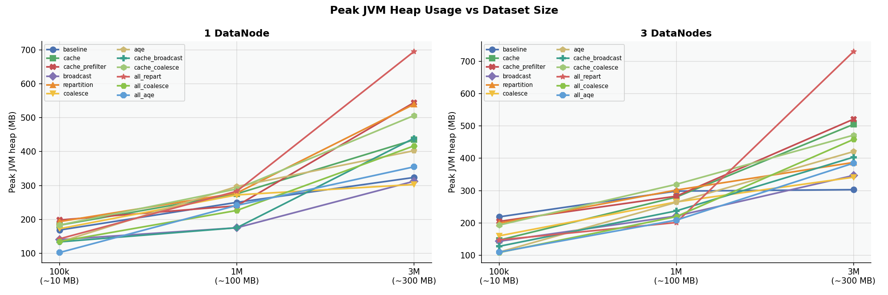
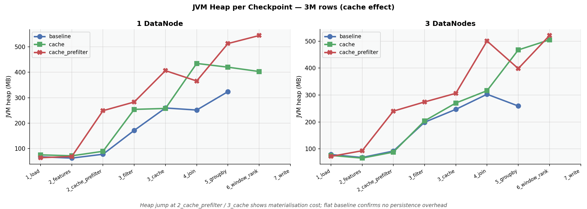

# Hadoop + Spark Lab

Distributed data processing experiment comparing HDFS cluster configurations (1 vs 3 DataNodes) and Spark optimization strategies across dataset sizes (100k / 1M / 3M rows).

---

## Requirements

- Docker Desktop with WSL2 integration enabled
- Python 3.12 with `pandas`, `numpy`, `matplotlib` installed locally (for dataset generation and plot rendering)

```bash
pip install -r requirements.txt
```

Everything else runs inside the `spark-client` Docker container.

---

## Dataset

Synthetic e-commerce transactions generated by `data/generate_dataset.py`.

| Column           | Type     | Values                          |
|------------------|----------|---------------------------------|
| `user_id`        | int      | 1 – 50 000                      |
| `product_id`     | int      | 1 – 5 000                       |
| `quantity`       | int      | 1 – 20                          |
| `price`          | float    | varies by category (USD)        |
| `discount`       | float    | 0.0 – 0.5                       |
| `category`       | string   | 8 categories                    |
| `payment_method` | string   | 5 methods                       |
| `region`         | string   | 6 regions                       |

```bash
python data/generate_dataset.py 1000000   # generates data/transactions.csv
```

---

## Hadoop configuration

| Setting | 1DN | 3DN |
|---|---|---|
| Block size | 128 MB | 128 MB |
| Replication | 1 | 3 |
| NameNode memory | 1 GB | 1 GB |
| DataNode memory | 1 GB | 768 MB × 3 |

---

## Spark pipeline (`spark_app_conf.py`)

Nine timed checkpoints. Cache steps only appear in their respective variants.

| Checkpoint | Operation |
|---|---|
| `1_load` | Read CSV from HDFS |
| `2_features` | Feature engineering (`revenue`, `price_bucket`) |
| `2_cache_prefilter` | *(prefilter variant only)* Materialise cache of full featured DF |
| `3_filter` | Filter `discount > 0.1` + optional repartition/coalesce |
| `3_cache` | *(cache variant only)* Materialise cache of filtered DF |
| `4_join` | Join category metadata (broadcast or shuffle) |
| `5_groupby` | GroupBy aggregation per category × region |
| `6_window_rank` | Window rank by revenue within category |
| `7_write` | Write aggregation result to HDFS |

Steps 5 and 6 both read the filtered DF, making them the primary beneficiaries of caching.

### Memory tracking

JVM heap is sampled at each checkpoint via `Runtime.getRuntime()`. This reflects actual Spark memory usage (shuffle buffers, cached data, sort spill) rather than the Python process RSS which is a ~90 MB constant (Py4J wrapper overhead).

### Optimization flags

| Flag | Effect |
|------|--------|
| `--cache` | Materialise filtered DF into memory; steps 5 and 6 skip HDFS re-scan |
| `--cache-prefilter` | Cache before filter — larger DF persisted; order-of-ops contrast |
| `--broadcast` | `F.broadcast()` on metadata join — no shuffle for small table |
| `--repartition N` | Full shuffle to N partitions after filter |
| `--coalesce N` | Merge-only reduction to N partitions, no shuffle |
| `--aqe` | Adaptive Query Execution — reactive partition coalescing |

`--repartition` and `--aqe` target the same problem from opposite directions and are kept in separate experiments.

---

## Experiment matrix

**72 experiments:** 3 sizes × 2 clusters × 12 variants

| Variant | Flags |
|---------|-------|
| `baseline` | — |
| `cache` | `--cache` |
| `cache_prefilter` | `--cache-prefilter` |
| `broadcast` | `--broadcast` |
| `repartition` | `--repartition 8` |
| `coalesce` | `--coalesce 4` |
| `aqe` | `--aqe` |
| `cache_broadcast` | `--cache --broadcast` |
| `cache_coalesce` | `--cache --coalesce 4` |
| `all_repart` | `--cache --broadcast --repartition 8` |
| `all_coalesce` | `--cache --broadcast --coalesce 4` |
| `all_aqe` | `--cache --broadcast --aqe` |

---

## Running

### Full matrix (~60–120 min)

```bash
rm -f results/experiment_results.json
bash run_all.sh
```

### Manual single experiment

```bash
docker exec spark-client spark-submit \
  --master local[*] \
  --driver-memory 1g \
  --conf "spark.driver.extraJavaOptions=-Dlog4j.configuration=file:/app/config/log4j.properties" \
  /app/spark/spark_app_conf.py \
  --hdfs hdfs://namenode:9000 \
  --label 3M_1dn_cache_broadcast \
  --cache --broadcast
```

### Regenerate plots only

```bash
python results/compare_results.py
```

---

## Results

| File | Description |
|------|-------------|
| `experiment_results.json` | Raw timing and RAM data for all experiments |
| `spark_run.log` | Full Spark log across all runs |
| `plot_time_vs_size.png` | Total execution time per variant across sizes |
| `plot_speedup_heatmap.png` | Speedup vs baseline (variant × size) |
| `plot_cache_order.png` | Cache placement: post-filter vs pre-filter |
| `plot_partition_strategies.png` | Repartition vs coalesce vs AQE |
| `plot_step_breakdown.png` | Per-step stacked bar at 3M rows |
| `plot_ram_peak.png` | Peak JVM heap per variant across sizes |
| `plot_ram_cache_effect.png` | JVM heap per checkpoint showing cache materialisation jump |

### Plots

**Total execution time vs dataset size**


**Speedup vs baseline**


**Cache placement (order of operations)**


**Partition strategies**


**Per-step breakdown — 3M rows**


**Peak JVM heap across sizes**


**JVM heap per checkpoint — cache materialisation effect**


---

## Troubleshooting

**NameNode stays in safe mode**
```bash
docker exec namenode hdfs dfsadmin -safemode leave
```

**DataNodes not registering**
```bash
docker exec namenode hdfs dfsadmin -report
# 3DN cluster needs ~75s after compose up
```

**Row count at `1_load` doesn't match generate_dataset.py**
HDFS upload was interrupted — the `._COPYING_` suffix file was promoted. Re-upload:
```bash
docker exec namenode hdfs dfs -rm -f /data/transactions.csv
docker cp data/transactions.csv namenode:/tmp/transactions.csv
docker exec namenode hdfs dfs -put /tmp/transactions.csv /data/transactions.csv
```

**Port 9000 already in use**
```bash
ss -tlnp | grep 9000
docker compose -f docker/1dn/docker-compose.yml down -v
```